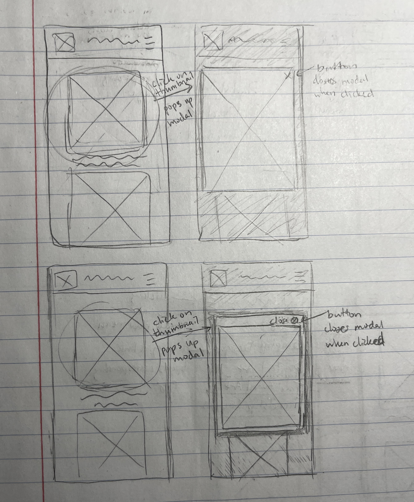
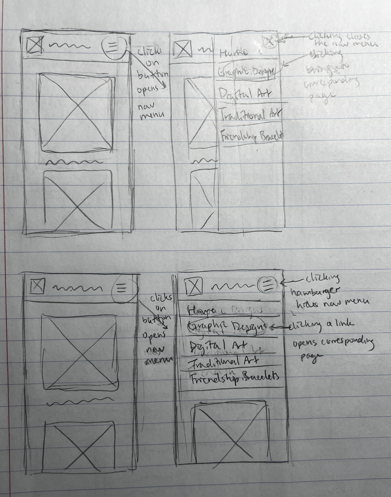
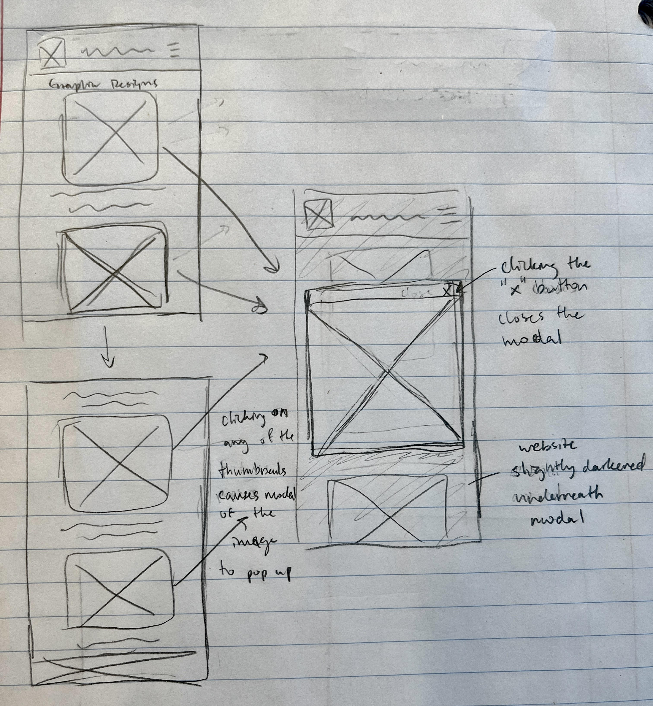
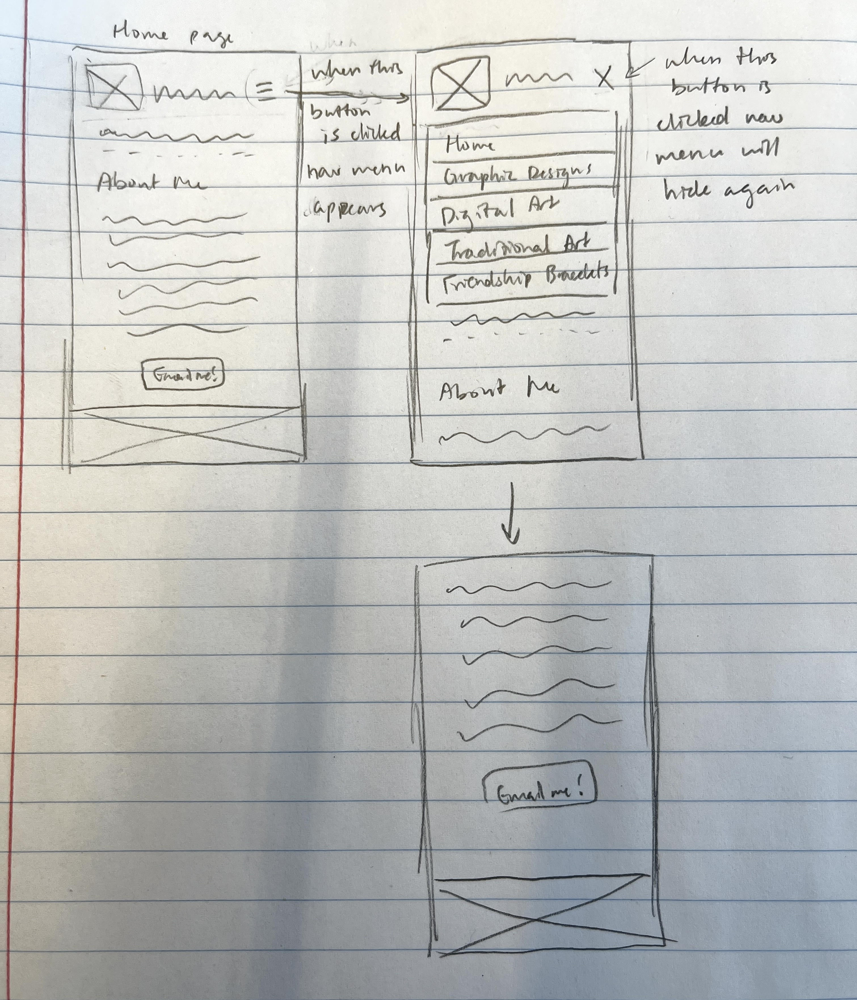
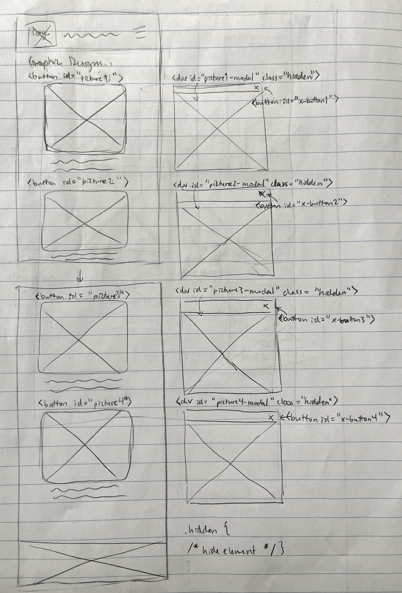
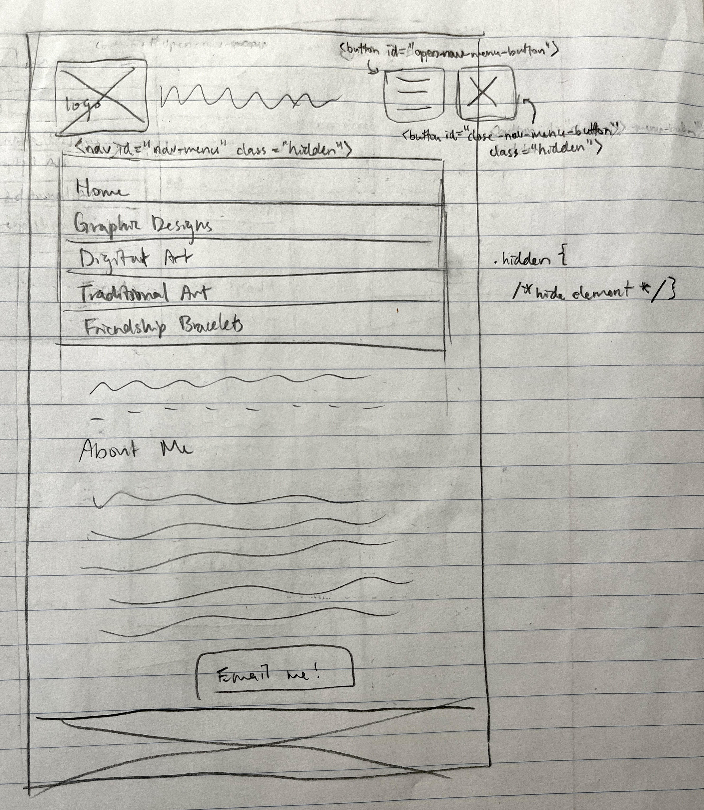

# Project 3: Design Journey

**For each milestone, complete only the sections that are labeled with that milestone.** Refine all sections before the final submission.

You are graded on your design process. If you later need to update your plan, **do not delete the original plan, leave it in place and append your new plan _below_ the original.** Then explain why you are changing your plan. Any time you update your plan, you're documenting your design process!

**Replace ALL _TODOs_ with your work.** (There should be no TODOs in the final submission.)

Be clear and concise in your writing. Bullets points are encouraged.

Place all design journey images inside the "design-plan" folder and then link them in Markdown so that they are visible in Markdown Preview.

**Everything, including images, must be visible in _Markdown: Open Preview_.** If it's not visible in the Markdown preview, then we can't grade it. We also can't give you partial credit either. **Please make sure your design journey should is easy to read for the grader;** in Markdown preview the question _and_ answer should have a blank line between them.


## Existing Project (Milestone 1)

**Tell us about the project you'll be using for Project 3.**

### Project (Milestone 1)
> Which project will you add interactivity to enhance the site's functionality?

Project 1


### Audience (Milestone 1)
> Briefly explain your site's audience. (1-2 sentences)
> Be specific and justify why this audience is a **cohesive** group.

The intended audience for my website will be job recruiters interested in hiring someone with artistic ability. This audience will visit my website to see a portfolio of my artwork and other personal projects. Because I intend for my website to be a portfolio of my work, this seems like the most likely audience who will see my website.


### Audience's Goals (Milestone 1)
> List the audience's goals that you identified in Project 1 or 2.
> Simply list each goal. No need to include the "Design Ideas and Choices", etc.
> You may adjust the goals if necessary.

1. Users visit my website to look at my art.

2. They also visit to measure my skill level at certain crafts.

3. Users visit the site to determine whether they would like to hire me.


## Interactivity Design (Milestone 1)

### Modal Interactivity Brainstorm (Milestone 1)
> Using the audience goals you identified, brainstorm possible options for **modal** interactivity to enhance the functionality of the site while also assisting the audience with their goals.
> Briefly explain each idea and provide a brief rationale for how the interactivity enhances the site's functionality for the audience. (1 sentence)
> Note: You may find it easier to sketch for brainstorming. That's fine too. Do whatever you need to do to explore your ideas.

- A modal which enlargens the image of the thumbnail that is clicked - it will help my audience look at my artwork by making my artwork the central focus point.
- A modal that pops up with my contact information - helps my audience get into contact with me if they are interested in hiring me.


### Interactivity Design Ideation (Milestone 1)
> Explore the possible design solutions for the interactivity.
> Sketch at least two iterations of the modal and at least two iterations of the hamburger menu interactivity.
> Annotate each sketch explaining what happens when a user takes an action. (e.g. When user clicks this, something else appears.)

Modal Sketches


Hamurger Menu Sketches



### Final Interactivity Design Sketches (Milestone 1)
> Create _polished_ sketch(es) (it's still a sketch, but with a little more care taken to communicate ideas clearly to the graders) to plan your interactivity.
> **Sketch out the entire page where your interactivity will go.**
> Include your interactivity to the sketch(es).
> Add annotations to explain what happens when the user takes an action.
> Include as many sketches as necessary to communicate your design (ask yourself, could another 1300 take these sketches an implement my design?)

**Modal design sketches:**



**Hamburger drop-down navigation menu design sketches:**




### Interactivity Rationale (Milestone 1)
> Describe the purpose of your proposed interactivity.
> Provide a brief rationale explaining how your proposed interactivity addresses the goals of your site's audience.
> This should be about a paragraph. (2-4 sentences)

Creating a hamburger menu that the user can interact with to hide or show the nav menu helps declutter the page, since the nav menu takes up a lot of space on the screen. By hiding the nav menu, the user is more easily able to locate the content that they want as they don't need to scroll as much to find it. The modal shows a larger image of the thumbnail when clicked. This helps the user focus on a looking at a single piece of art and look at a larger image of the art to see more details.


## Interactivity Implementation Plan (Milestone 1)

### Interactivity Planning Sketches (Milestone 1)
> Produce planning sketches that include all the details another 1300 student would need to implement your interactivity design.
> Your planning sketches should include _all_ HTML elements needed for the interactivity; _annotations_ for the element types, their unique IDs, and CSS classes; and lastly the initial CSS classes.

**Modal planning sketches:**



**Hamburger drop-down navigation menu planning sketches:**




### Interactivity Pseudocode Plan (Milestone 1)
> Write your interactivity pseudocode plan here.
> Pseudocode is not JavaScript. Do not put JavaScript code here.

**Modal pseudocode:**

Open the modal:

```
when #picture1 clicked:
    #picture1-modal remove .hidden
    #picture2-modal add .hidden
    #picture3-modal add .hidden
    #picture4-modal add .hidden
when #picture2 clicked:
    #picture1-modal add .hidden
    #picture2-modal remove .hidden
    #picture3-modal add .hidden
    #picture4-modal add .hidden
when #picture3 clicked:
    #picture1-modal add .hidden
    #picture2-modal add .hidden
    #picture3-modal remove .hidden
    #picture4-modal add .hidden
when #picture4 clicked:
    #picture1-modal add .hidden
    #picture2-modal add .hidden
    #picture3-modal add .hidden
    #picture4-modal remove .hidden
```

Close the modal:

```
when #x-button1 clicked:
    #picture1-modal add .hidden
when #x-button2 clicked:
    #picture2-modal add .hidden
when #x-button3 clicked:
    #picture3-modal add .hidden
when #x-button4 clicked:
    #picture4-modal add .hidden
```

**Hamburger menu pseudocode:**

Pseudocode to show/hide (toggle) the navigation menu (narrow screens):

```
when #open-nav-menu-button clicked:
    #nav-menu remove .hidden
    #open-nav-menu-button add .hidden
    #close-nav-menu-button remove .hidden
when #close-nav-menu-button clicked:
    #nav-menu add .hidden
    #open-nav-menu-button remove .hidden
    #close-nav-menu-button add .hidden
```

Pseudocode to hide the hamburger button and show the navigation bar when the window is resized too wide:

```
when resized too wide:
    #nav-menu remove .hidden
    #open-nav-menu-button add .hidden
```

Pseudocode to show the hamburger button and hide the navigation menu when the window is resized too narrow:

```
when resized too narrow:
    #nav-menu add .hidden
    #open-nav-menu-button remove .hidden
```


## Grading (Final Submission)

### Interactivity Usability Justification (Final Submission)
> Explain how your design effectively uses affordances, visibility, feedback, and familiarity.
> Write a paragraph (3-5 sentences)

The design utilizes affordances by indicating interactive elements, such as the hamburger and x buttons for toggling the navigation menu, and thumbnail images that users can click on to view larger versions. Visibility is maintained by dynamically showing and hiding elements when the buttons are clicked, ensuring a clean interface where only the necessary items are displayed. Feedback is given instantaneously as the intended content appears or disappears immediately when users interact with the navigation buttons and thumbnails, reinforcing the users' actions. Familiarity is seen throughout the website through common web patterns, such as the hamburger menu commonly seen on narrow screen views, and thumbnails which when clicked on pop up modals for image enlargement. These align with standard web practices that users are likely to recognize.


### Tell Us What to Grade (Final Submission)
> We aren't re-grading your Project 1 or 2.
> We are only grading the interactivity you added.
> Tell us where (what pages) we can find your interactivity and how to use it.
> **We will only grade what you list here;** if it's not listed, we won't grade it.

The dropdown navigation menu interactivity can be found on every page of the website when the window is resized to below 700px in width. To use it, click on the hamburger menu icon (the three horizontal lines in the header), which will drop down the navigation menu. To hide the navigation menu, click the x icon that appears in place of the hamburger menu icon.

The modal interactivity can be found on the graphic designs, digital art, traditional art, and friendship braclets pages. To make the modal pop up, click on the thumbnail pictures (the pictures of the art) for an enlarged image of it. To close out of the modal, click the x button on the top right corner of the modal.


### Collaborators (Final Submission)
> List any persons you collaborated with on this project.

None


### Reference Resources (Final Submission)
> Please cite any external resources you referenced in the creation of your project.
> (i.e. W3Schools, StackOverflow, Mozilla, etc.)

https://developer.mozilla.org/en-US/


### Self-Reflection (Final Submission)
> This was the first project in this class where you coded some JavaScript. What did you learn from this experience?

I learned how to use JavaScript to enhance my website's interactivity to help achieve my audience's goals.


> Take some time here to reflect on how much you've learned since you started this class. It's often easy to ignore our own progress. Take a moment and think about your accomplishments in this class. Hopefully you'll recognize that you've accomplished a lot and that you should be very proud of those accomplishments!

I learned how to code in JavaScript and create an interactive website. I've also learned how to implement a hamburger menu and modals to a website.
